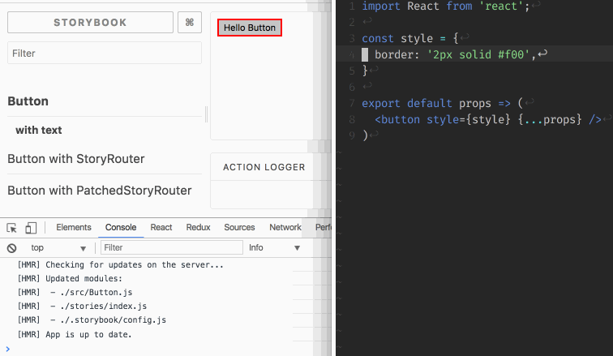

# storybook-router hot reloading test env

Repro steps:

1. Run storybook 

    ```
    yarn storybook
    ```

2. Modify `styles` of `src/Button.js`
3. Observer hot-reloading behavior of button stories

Screencap:


